# CareerFit AI – AI Interview Preparation & Resume Builder

A full-stack MERN-based AI web application that helps users prepare for job interviews by analyzing their resume, self-description, and target job description. The app generates a personalized interview preparation report, identifies skill gaps, creates technical and behavioral questions, provides a preparation roadmap, and allows users to download an ATS-friendly resume PDF.

---

## 🌐 Live Demo

- Frontend: https://ai-interview-prep-mern.vercel.app
- Backend API: https://ai-interview-prep-mern-1.onrender.com

## 🚀 Features

### Authentication

- User registration
- User login
- JWT-based authentication
- Cookie-based session handling
- Protected frontend routes
- Secure logout with token blacklist
- Current user rehydration using `get-me`

### AI Interview Report

- Upload resume in PDF format
- Enter target job description
- Enter self-description
- Generate AI-powered interview preparation report
- Match score generation
- Technical interview questions
- Behavioral interview questions
- Skill gap analysis
- Day-wise preparation roadmap

### Report Management

- View all previously generated reports
- Open a specific report by ID
- Reports are stored per authenticated user
- Protected report access

### Resume PDF Generation

- Generate downloadable ATS-friendly resume PDF
- AI-generated resume when Gemini is available
- Fallback PDF generation when Gemini quota is exhausted
- Professional file naming using username and job title

### Frontend

- React with Vite
- React Router
- Protected routes
- Context API state management
- Custom hooks
- Axios API layer
- SCSS styling
- Responsive dark UI

---

## 🛠️ Tech Stack

### Backend

- Node.js
- Express.js
- MongoDB
- Mongoose
- JWT
- bcrypt
- cookie-parser
- Multer
- pdf-parse
- Google Gemini API (`@google/genai`)
- Puppeteer
- dotenv
- cors

### Frontend

- React
- Vite
- React Router DOM
- Context API
- Custom Hooks
- Axios
- SCSS / Sass

### Tools

- Postman
- MongoDB Compass
- Git
- GitHub
- VS Code

---

## 📸 Screenshots

### Authentication APIs

#### Register API

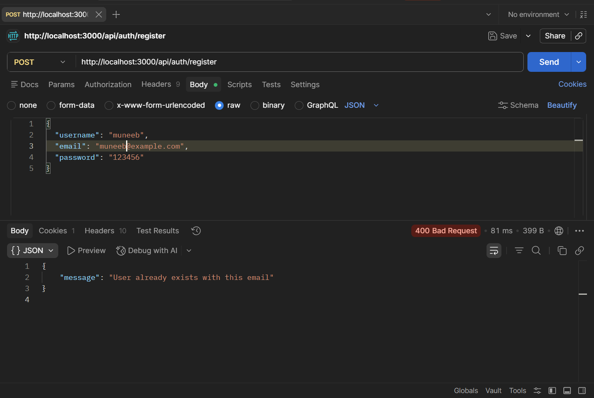

#### Login API

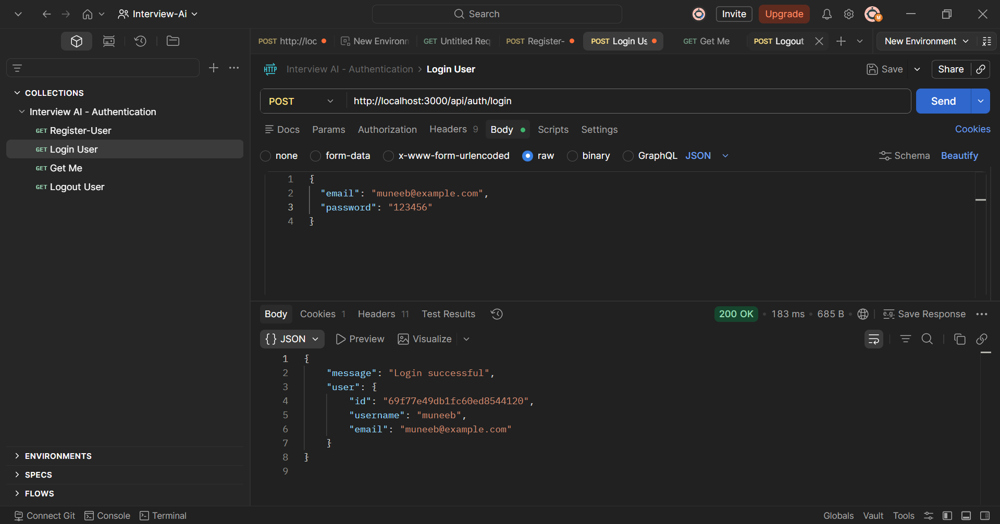

#### Get Me API

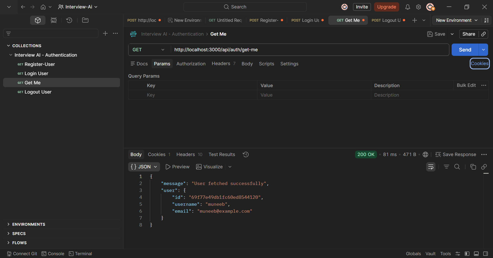

#### Logout API

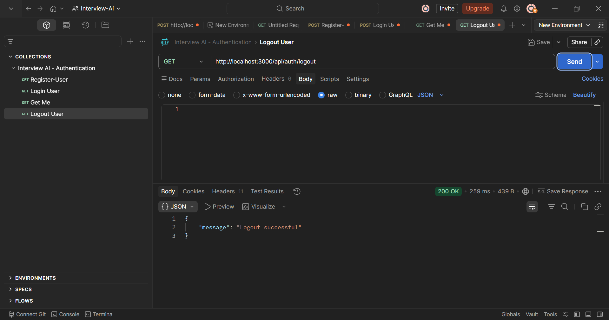

---

### Interview APIs

#### Generate Interview Report

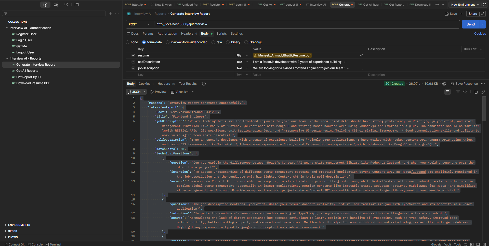

#### Get All Reports

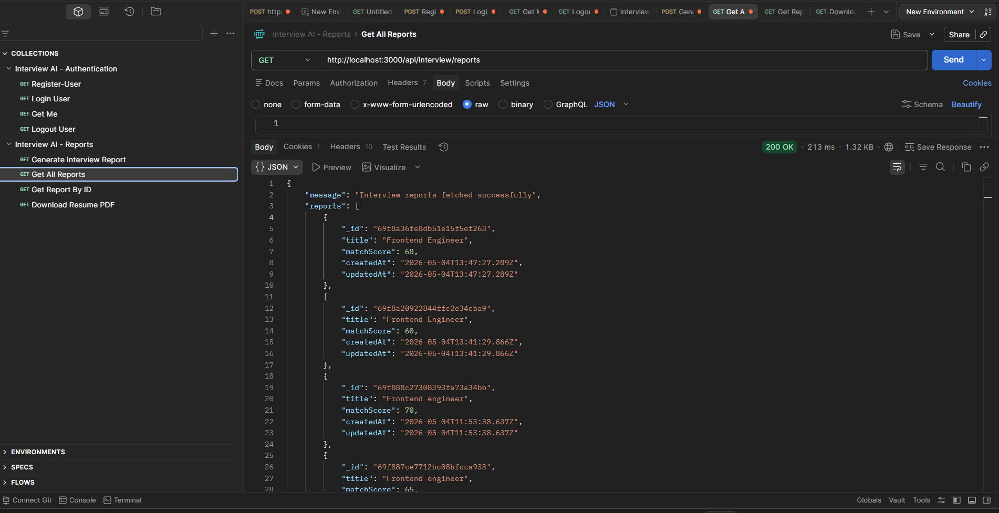

#### Get Report By ID

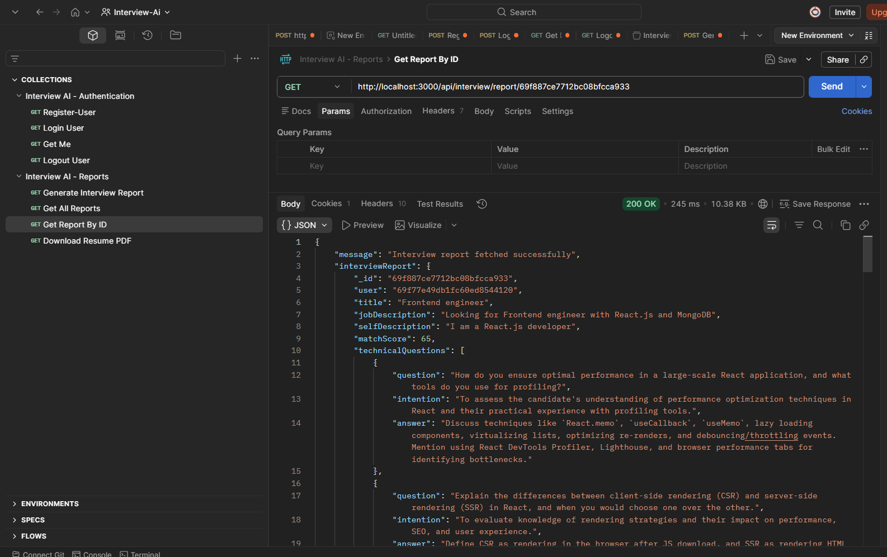

#### Download Resume PDF

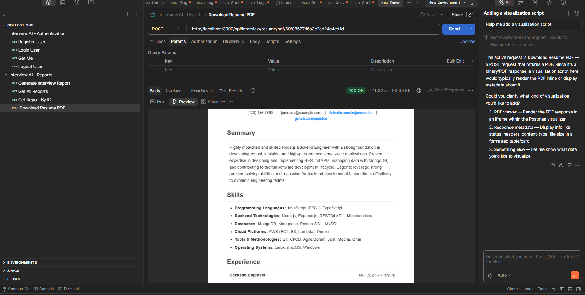

---

### Frontend UI

#### Login Page

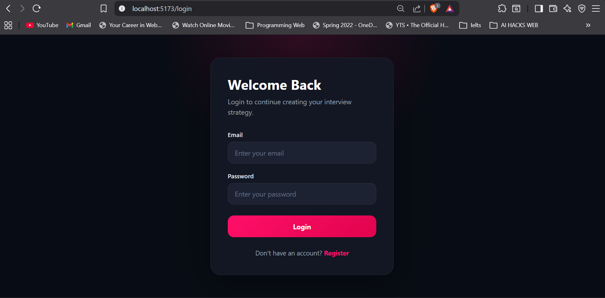

#### Register Page

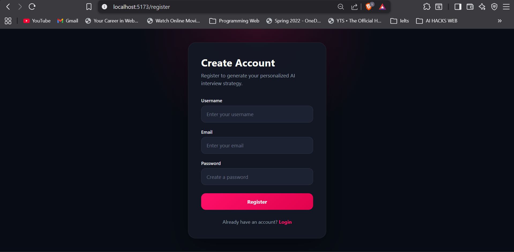

#### Home Page

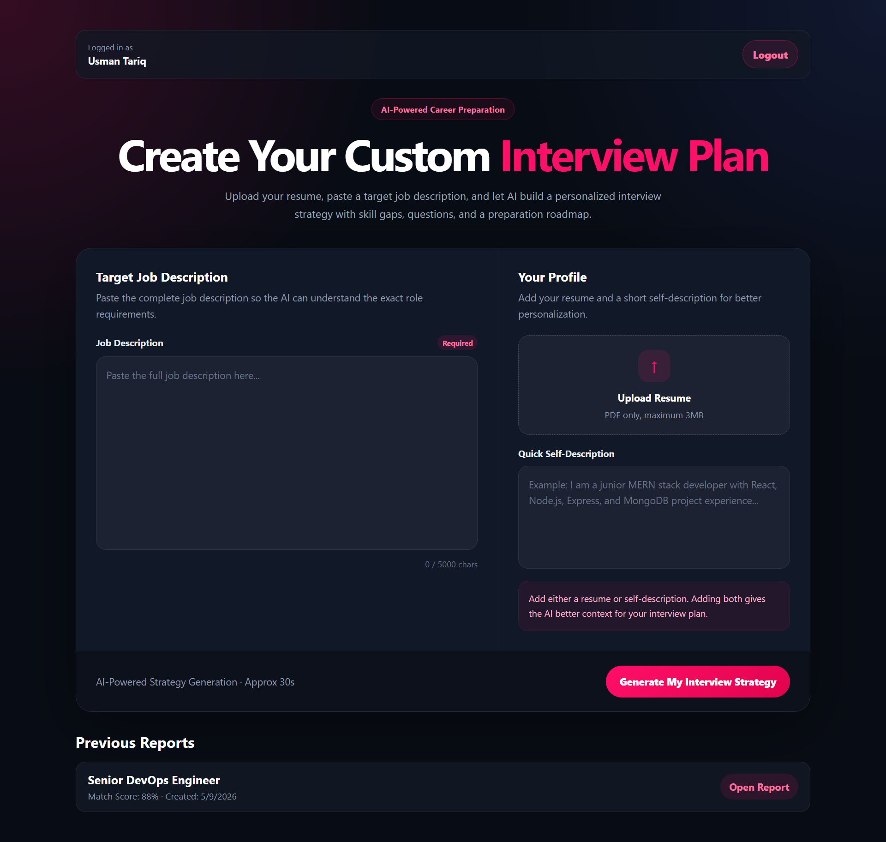

#### Interview Report Page

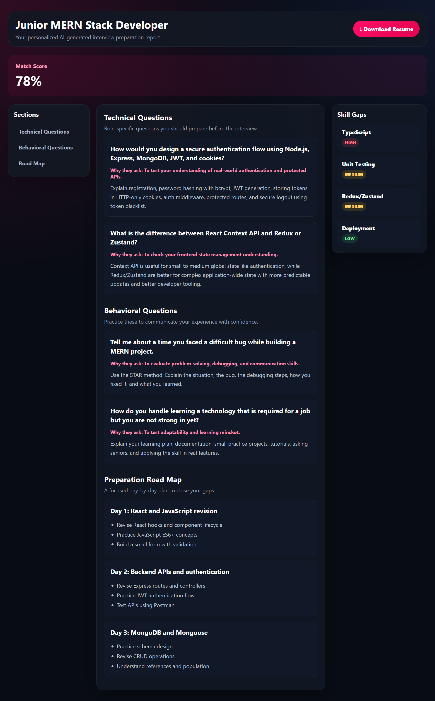

---

## 📄 Sample Generated Resume

A sample generated resume PDF can be found in the `samples` folder.

Example:

```text
samples/zara-khan_frontend-engineer_resume.pdf
```

> Note: Sample resumes are for demonstration purposes only.

---

## 📁 Project Structure

```text
CV GenAI/
│
├── Backend/
│   ├── src/
│   │   ├── controllers/
│   │   │   ├── auth.controller.js
│   │   │   └── interview.controller.js
│   │   │
│   │   ├── database/
│   │   │   └── database.js
│   │   │
│   │   ├── middlewares/
│   │   │   ├── auth.middleware.js
│   │   │   └── file.middleware.js
│   │   │
│   │   ├── models/
│   │   │   ├── user.model.js
│   │   │   ├── blacklist.model.js
│   │   │   └── interviewReport.model.js
│   │   │
│   │   ├── routes/
│   │   │   ├── auth.routes.js
│   │   │   └── interview.routes.js
│   │   │
│   │   ├── services/
│   │   │   └── ai.service.js
│   │   │
│   │   ├── app.js
│   │   └── server.js
│   │
│   ├── package.json
│   └── package-lock.json
│
├── Frontend/
│   ├── src/
│   │   ├── features/
│   │   │   ├── auth/
│   │   │   │   ├── components/
│   │   │   │   │   └── Protected.jsx
│   │   │   │   ├── hooks/
│   │   │   │   │   └── useAuth.js
│   │   │   │   ├── pages/
│   │   │   │   │   ├── Login.jsx
│   │   │   │   │   └── Register.jsx
│   │   │   │   ├── services/
│   │   │   │   │   └── auth.api.js
│   │   │   │   ├── auth.context.jsx
│   │   │   │   └── auth.form.scss
│   │   │   │
│   │   │   └── interview/
│   │   │       ├── hooks/
│   │   │       │   └── useInterview.js
│   │   │       ├── pages/
│   │   │       │   ├── Home.jsx
│   │   │       │   └── Interview.jsx
│   │   │       ├── services/
│   │   │       │   └── interview.api.js
│   │   │       └── interview.context.jsx
│   │   │
│   │   ├── style/
│   │   │   ├── Home.scss
│   │   │   └── interview.scss
│   │   │
│   │   ├── app.routes.jsx
│   │   ├── App.jsx
│   │   ├── main.jsx
│   │   └── style.scss
│   │
│   ├── package.json
│   └── package-lock.json
│
├── screenshots/
├── samples/
├── .gitignore
└── README.md
```

---

## 🔐 Environment Variables

Create a `.env` file inside the `Backend` folder:

```env
PORT=3000
MONGO_URI=your_mongodb_connection_string
JWT_SECRET=your_jwt_secret
GOOGLE_GENAI_API_KEY=your_google_gemini_api_key
CLIENT_URL=http://localhost:5173
```

> Never commit your `.env` file to GitHub.

---

## ⚙️ Installation & Setup

### 1. Clone the repository

```bash
git clone https://github.com/muneeb123469/careerfit-ai.git
cd careerfit-ai
```

### 2. Setup Backend

```bash
cd Backend
npm install
```

Create a `.env` file inside the `Backend/` folder and add the required environment variables.

Run backend:

```bash
npm run dev
```

Backend will run on:

```text
http://localhost:3000
```

### 3. Setup Frontend

Open a new terminal:

```bash
cd Frontend
npm install
```

Run frontend:

```bash
npm run dev
```

Frontend will run on:

```text
http://localhost:5173
```

---

## 📡 API Endpoints

### Auth APIs

| Method | Endpoint             | Description                     |
| ------ | -------------------- | ------------------------------- |
| POST   | `/api/auth/register` | Register a new user             |
| POST   | `/api/auth/login`    | Login user                      |
| GET    | `/api/auth/get-me`   | Get logged-in user              |
| GET    | `/api/auth/logout`   | Logout user and blacklist token |

### Interview APIs

| Method | Endpoint                                       | Description                       |
| ------ | ---------------------------------------------- | --------------------------------- |
| POST   | `/api/interview`                               | Generate interview report         |
| GET    | `/api/interview/reports`                       | Get all reports of logged-in user |
| GET    | `/api/interview/report/:interviewId`           | Get one report by ID              |
| POST   | `/api/interview/resume/pdf/:interviewReportId` | Generate/download resume PDF      |

---

## 🧠 How It Works

1. User registers or logs in.
2. JWT token is stored in an HTTP-only cookie.
3. User uploads a resume PDF and enters a job description.
4. Backend extracts resume text using `pdf-parse`.
5. Gemini AI generates a structured interview preparation report.
6. Report is saved in MongoDB.
7. User can view previous reports and open report details.
8. User can download an ATS-friendly resume PDF.
9. If Gemini is unavailable or quota is exhausted, the app generates a fallback PDF using Puppeteer.

---

## 🧱 Frontend Architecture

The frontend follows a clean four-layer structure:

```text
UI Layer       → React pages/components
Hook Layer     → Custom hooks
State Layer    → Context API
API Layer      → Axios service files
```

Example:

```text
Home.jsx
  ↓
useInterview.js
  ↓
interview.context.jsx
  ↓
interview.api.js
  ↓
Backend API
```

---

## ✅ Completed Functionality

- User registration
- User login
- Logout
- JWT authentication
- Protected frontend routes
- Resume upload
- AI interview report generation
- Previous reports list
- Report details page
- Resume PDF download
- Professional resume file naming
- Fallback PDF generation
- Postman API testing
- GitHub screenshots and sample outputs

---

## 🚧 Future Improvements

- Add password validation rules
- Add forgot password flow
- Add dashboard analytics
- Improve resume template design
- Add multiple resume templates
- Add better AI error messages
- Add deployment on Render/Vercel
- Add TypeScript version
- Add unit tests
- Add loading skeletons and toast notifications
- Add user profile page
- Add report delete feature

---

## 👨‍💻 Author

**Muneeb Ahmad Bhatti**

- GitHub: [muneeb123469](https://github.com/muneeb123469)
- LinkedIn: [Muneeb Bhatti](https://linkedin.com/in/muneeb-bhatti-032806225)
- Email: muneebahmadbhatti786@gmail.com

---

## 📌 Project Purpose

This project was built as a portfolio-level MERN + AI application to demonstrate practical full-stack development skills, authentication, protected routes, MongoDB data handling, AI integration, PDF generation, and clean React architecture.

It is designed to help job seekers prepare for interviews and generate role-specific preparation material.
